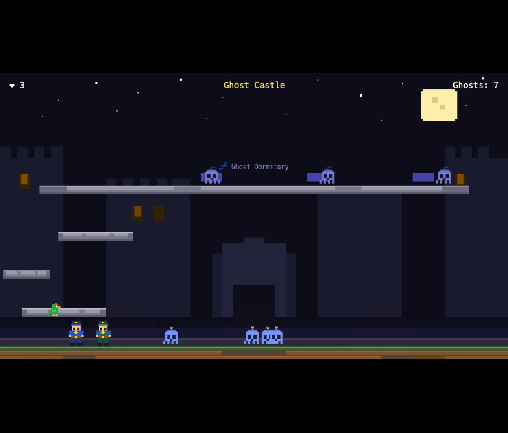

# Hotodog-Geist


**Hotodog-Geist** is a co-op browser game for kids (ages 6+) built with Phaser 3, TypeScript and Vite.
Two police officers team up to stun and arrest ghosts and monsters across six levels — from city streets and spooky castles to a speeding train and a police ship at sea.

🎮 **[Play the live demo](https://karma-works.github.io/hotdog-geist/)**

---

## Screenshot



---

## Features

- **6 levels** with distinct mechanics
  - 🏙️ City Streets — wave after wave of monsters on a single screen
  - 🏰 Police Castle — defend the gate from ghost waves; three lives for the castle
  - 👻 Ghost Castle — sleeping ghosts in a dormitory; platforms shrink over 60 s; all ghosts descend after 30 s
  - 🚂 Train — arrest criminals on a speeding train; don't fall through the gaps!
  - 🚢 Police Ship — fight on deck and below deck with a fall-into-the-sea hazard
  - 🚗 Car Road — final showdown
- **2-player co-op** (keyboard split) or **1-player + AI companion**
- **Parrot companion** that delivers comedy items mid-level
- **Stun → arrest** mechanic: shoot to stun, walk close to handcuff
- **Overworld map** to track progress and star ratings
- SVG assets rendered at crisp pixel scale

---

## Controls

| Action | Player 1 | Player 2 |
|--------|----------|----------|
| Move   | Arrow keys | WASD |
| Jump   | Up / W | — |
| Shoot  | Space | F |

---

## Development

```bash
npm install
npm run dev      # dev server at http://localhost:5173
npm run build    # production build → dist/
```

Jump straight to a level during development:

```
http://localhost:5173?level=3          # by number (1–6)
http://localhost:5173?level=GhostCastle  # by name
```

---

## Tech Stack

| | |
|---|---|
| Game engine | [Phaser 3](https://phaser.io/) |
| Language | TypeScript |
| Bundler | Vite |
| Assets | SVG (rendered at 2× design size) |
| i18n | i18next |

---

## License

[MIT](LICENSE) © 2025 karma-works
